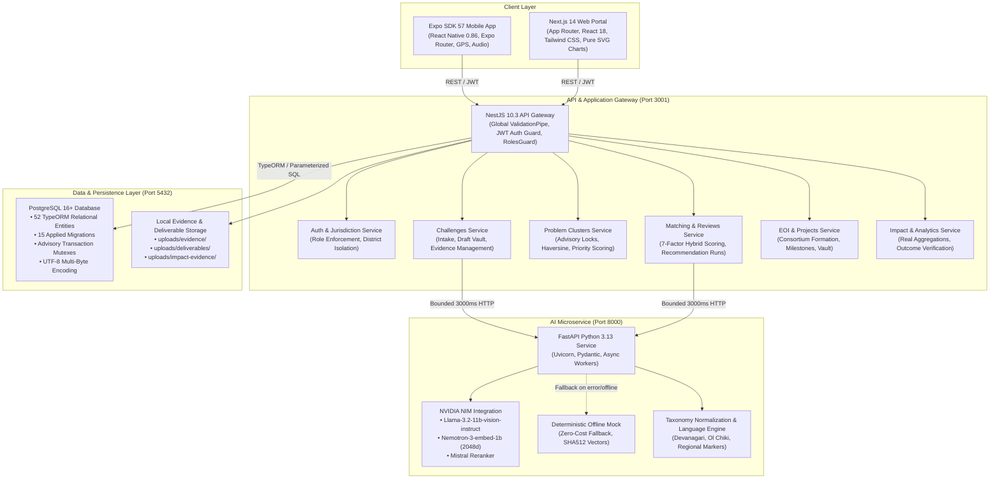
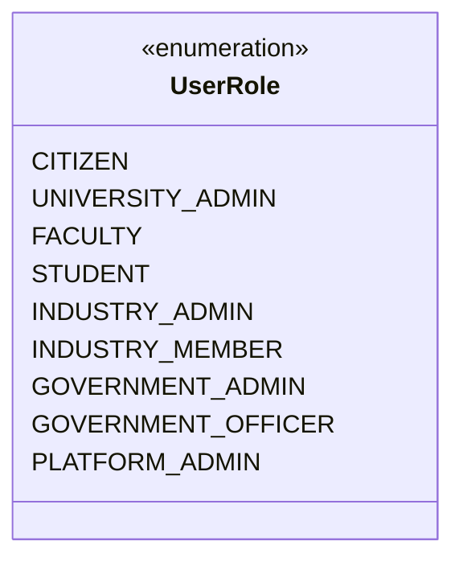
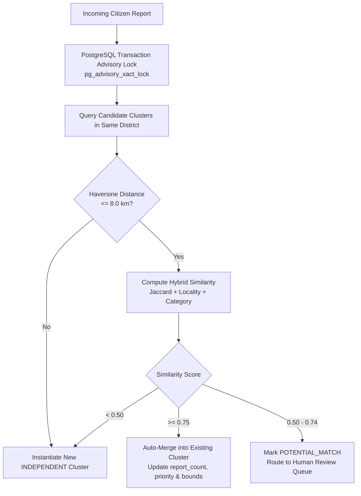
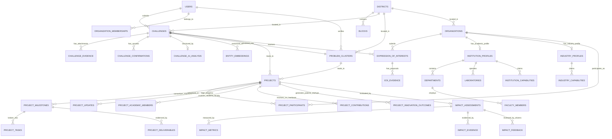
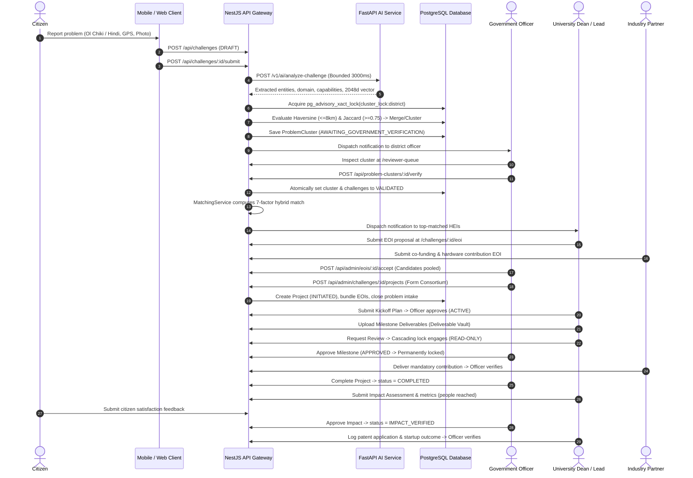

# ResolvIN — Current Master Project Report
## AI-Powered Multi-Stakeholder Civic Problem Intelligence & Collaborative Innovation Platform

**Execution & Audit Date:** September 23, 2026  
**Target Ecosystem:** Jharkhand Civic Crowdsourcing & Multi-Stakeholder Innovation Orchestration  
**Repository Workspace:** `d:\Projects\Crowdsource`  
**Operational Status:** All 5 Core Services Operational (PostgreSQL, NestJS API, FastAPI AI Microservice, Next.js Web, Expo Mobile)  
**Primary Source of Truth:** Active Codebase & Verified Schema (52 TypeORM Entities, 15 Applied Migrations, 19+ Master Test Suites, 100% Pass Rate)

---

## Table of Contents

1. [Executive Summary](#1-executive-summary)
2. [Problem Statement](#2-problem-statement)
3. [ResolvIN Solution](#3-resolvin-solution)
4. [Project Objectives](#4-project-objectives)
5. [Overall Architecture](#5-overall-architecture)
6. [Complete Technology Stack](#6-complete-technology-stack)
7. [User Roles & Stakeholders](#7-user-roles--stakeholders)
8. [Authentication & Authorization](#8-authentication--authorization)
9. [Citizen Workflow](#9-citizen-workflow)
10. [AI Intelligence Pipeline](#10-ai-intelligence-pipeline)
11. [Multilingual Architecture](#11-multilingual-architecture)
12. [Problem Structuring](#12-problem-structuring)
13. [Problem Taxonomy](#13-problem-taxonomy)
14. [Priority Analysis](#14-priority-analysis)
15. [Embedding Architecture](#15-embedding-architecture)
16. [Clustering & Deduplication](#16-clustering--deduplication)
17. [Government Verification](#17-government-verification)
18. [Government Intelligence Dashboard](#18-government-intelligence-dashboard)
19. [Capability Passport](#19-capability-passport)
20. [Institution Matching](#20-institution-matching)
21. [Industry / CSR Participation](#21-industry--csr-participation)
22: [EOI Workflow](#22-eoi-workflow)
23. [Project Formation](#23-project-formation)
24. [Academic Collaboration](#24-academic-collaboration)
25. [Milestone Management](#25-milestone-management)
26. [Impact Verification](#26-impact-verification)
27. [Innovation Outcomes](#27-innovation-outcomes)
28. [Mobile Application](#28-mobile-application)
29. [Database Architecture](#29-database-architecture)
30. [API Architecture](#30-api-architecture)
31. [Security Architecture](#31-security-architecture)
32. [Reliability Engineering](#32-reliability-engineering)
33. [Concurrency & Transaction Safety](#33-concurrency--transaction-safety)
34. [Testing Architecture](#34-testing-architecture)
35. [End-to-End Workflow](#35-end-to-end-workflow)
36. [Algorithms & Technical Techniques](#36-algorithms--technical-techniques)
37. [Current Feature Matrix](#37-current-feature-matrix)
38. [Current Limitations](#38-current-limitations)
39. [Future Enhancements](#39-future-enhancements)
40. [Technical Differentiators](#40-technical-differentiators)
41. [Current Implementation Status](#41-current-implementation-status)
42. [Conclusion](#42-conclusion)

---

## 1. Executive Summary

**ResolvIN** is an enterprise-grade digital civic intelligence, crowdsourcing, and multi-stakeholder innovation orchestration platform designed for regional and grassroots governance in Jharkhand, India. 

Rather than treating civic grievances as isolated complaints routed to administrative silos, ResolvIN introduces an **AI-structured problem-to-solution pipeline**. Grassroots citizens submit localized societal problems—in regional languages and scripts including Hindi, Santali in Ol Chiki script, and Nagpuri—via web and mobile interfaces. The system performs automated linguistic detection, civic translation, root-cause entity extraction, and 2048-dimensional vector embedding. 

A deterministic, concurrency-safe clustering engine (powered by **PostgreSQL Advisory Locks**, Haversine geographic boundary gating, and lexical Jaccard similarity) consolidates localized reports into unified **Problem Clusters** with transparent, explainable priority scoring. Verified government reviewers evaluate clusters on an executive-grade **Government Intelligence Dashboard**, preventing AI autonomy in public policy allocation. 

Once approved, validated problems enter a **7-Factor Hybrid Matching Engine** that matches challenges against institutional **Capability Passports** from universities, technical institutes, startups, and corporate CSR entities. Higher Education Institutions (HEIs) and industries submit **Expressions of Interest (EOIs)**, which government administrators bundle into collaborative **Consortium Projects**. The platform enforces rigorous project milestone tracking with cascading deliverable vault locks, anti-astroturfing citizen beneficiary feedback, quantitative impact verification, and intellectual property/patent outcome tracking.

---

## 2. Problem Statement

Across regional governance in India, civic grievance redressal faces systemic structural failures:

1. **Unstructured & Vernacular Fragmentation**: Grievances filed in local dialects (Santali, Nagpuri, Khortha, Kurukh, Mundari) often lack technical problem formulation, root cause diagnostics, or structured attributes, leading to automated dismissals or translation misinterpretations.
2. **Duplicate Administrative Backlogs**: A single infrastructure failure (e.g., a collapsed culvert on a rural road or a blown village transformer) generates dozens of individual citizen complaints. Without spatial-semantic deduplication, government officers face redundant backlogs rather than a single unified civic signal.
3. **Absence of Technical Solutions & R&D Linkage**: Municipal authorities often lack specialized engineering capabilities to solve complex problems (e.g., fluoride/arsenic water contamination, seasonal crop blight, rural bridge subsidence). Meanwhile, local engineering universities (e.g., BIT Mesra, NIT Jamshedpur, IIT Dhanbad, Birsa Agricultural University) have faculty, testing laboratories, and student researchers seeking real-world capstone projects, but have zero formalized intake linkage to grassroots civic problems.
4. **Disjointed Industry & CSR Engagement**: Industry partners and mining corporations in mineral-rich states like Jharkhand have statutory CSR funding and technical resources, but lack transparent mechanisms to co-fund and validate vetted community projects.
5. **Lack of Lifecycle Accountability**: Traditional grievance portals close tickets upon bureaucratic reassignment rather than verified field outcome delivery. There is no proof vault, milestone lock, or citizen verification after completion.

---

## 3. ResolvIN Solution

ResolvIN solves this paradigm through a closed-loop, multi-stakeholder value chain:

```
[Grassroots Citizen] ──> Multilingual Intake (Ol Chiki, Devanagari, Voice, GPS)
                                ↓
[AI Intelligence]    ──> Language Detection, Civic Translation, 2048d Embeddings
                                ↓
[Clustering Engine]  ──> Concurrency-Safe Haversine (<=8km) + Jaccard Clustering
                                ↓
[Government Gate]    ──> District-Scoped Officer Verification (Human-in-the-Loop)
                                ↓
[Matching Engine]    ──> 7-Factor Hybrid Matching against Institutional Passports
                                ↓
[Consortium Pool]    ──> Universities (R&D) + Industry (CSR/Hardware) Submit EOIs
                                ↓
[Project Governance] ──> Multi-Party Consortium Project with Milestone Lock Vault
                                ↓
[Impact Verification]──> Field Proof, Citizen Feedback & Patent/Startup Outcomes
```

---

## 4. Project Objectives

1. **Democratize Citizen Problem Reporting**: Enable citizens of any literacy level or regional language background to report civic problems with geotagging, voice input, and photographic evidence.
2. **Automate Civic Problem Intelligence**: Extract standardized domains, severity ratings, and technical requirements automatically without mutating original citizen submissions.
3. **Eliminate Duplicate Redundancy**: Automatically cluster localized citizen reports within an 8km spatial radius using transactional advisory locks to prevent database race conditions.
4. **Enforce Human-in-the-Loop Governance**: Ensure that public resources and solution matching are never initiated by AI alone; an authorized government officer must validate every problem cluster.
5. **Bridge Academic Research with Civic Impact**: Match validated societal problems directly with accredited university laboratories, faculty expertise, and student talent.
6. **Incentivize Industry CSR Co-Funding**: Provide formal consortium structures for corporate partners to commit hardware, funding, testing, and pilot deployments.
7. **Verify Real-World Impact**: Transition projects to "Completed" and "Impact Verified" only when approved deliverables, verifiable metrics, citizen feedback, and innovation outcomes are proven.

---

## 5. Overall Architecture

The platform is designed as a distributed, modular, multi-service architecture adhering to strict separation of concerns:



---

## 6. Complete Technology Stack

| Layer | Technology | Version | Purpose & Implementation Location |
| :--- | :--- | :--- | :--- |
| **Frontend Web** | Next.js / React | 14.2.35 / 18.2.0 | Administrative & citizen web application (`frontend/`) |
| **Frontend Styling** | Tailwind CSS | 3.4.1 | Utility-first, responsive, accessible UI styling |
| **Icons** | Lucide React | 0.312.0 | Consistent iconography across dashboards and wizards |
| **Charts / Visuals** | Pure SVG + CSS | Native Next.js 14 | Responsive, zero-dependency visual analytics (`government-intelligence-charts.tsx`) |
| **Mobile App** | Expo SDK / React Native | 57.0.20 / 0.86.3 | Cross-platform citizen mobile client (`mobile/`) |
| **Mobile Navigation** | Expo Router | 57.0.19 | File-based routing for mobile screens (`mobile/app/`) |
| **Mobile Hardware** | Expo Location, Audio, ImagePicker | ~57.0.x | GPS coordinates, native audio recording, camera photo evidence |
| **Backend API** | NestJS | 10.3.0 | Modular REST API gateway and business services (`backend/`) |
| **Runtime Environment** | Node.js | v22.18.0 LTS | High-performance asynchronous JavaScript engine |
| **Database Engine** | PostgreSQL | 18.4 (Dev embedded) / 16+ | ACID relational storage, transactional advisory locks (`backend/.pgdata`) |
| **ORM & Migrations** | TypeORM | 0.3.20 | Entity relational mapping and 15 sequential migrations |
| **AI Microservice** | FastAPI | 0.109+ | Python asynchronous microservice (`ai-service/`) |
| **AI Python Runtime** | Python | 3.13.2 | Isolated virtual environment (`ai-service/venv`) |
| **LLM Provider** | NVIDIA NIM Cloud API | Llama-3.2-11b-vision-instruct | Zero-shot structured JSON entity and problem extraction |
| **Embedding Model** | NVIDIA NIM Cloud API | Nemotron-3-embed-1b | 2048-dimensional dense vector embeddings |
| **Reranker Model** | NVIDIA NIM / Fallback | Mistral Rerank QA / Deterministic | Neural cross-encoder candidate organization reranking |
| **AI Fallback Engine** | Custom Python Engine | Deterministic Mock | 100% offline, zero-network fallback with SHA-512 pseudo-vectors |
| **Speech-to-Text** | Sarvam AI / Whisper API | Cloud / Local | Vernacular speech transcription (`Voice/`, `src/modules/voice/`) |
| **Authentication** | Passport / JWT | 10.0.3 / 10.2.0 | Stateless Bearer token authentication (`backend/src/modules/auth/`) |
| **Password Security** | BcryptJS | 3.0.3 | Salted one-way cryptographic hashing (10 salt rounds) |
| **Scheduling** | NestJS Schedule | 4.1.1 | Hourly automated draft cleanup cron jobs |
| **Testing** | ts-node / Mocha-style Asserts | 10.9.2 | 19 master test suites + reliability suite (1,000+ assertions) |
| **PDF Generation** | Microsoft Edge Headless | Windows System | Clean headless HTML-to-PDF rendering engine |

---

## 7. User Roles & Stakeholders

The platform enforces a 9-role Role-Based Access Control (RBAC) model defined in `backend/src/common/enums/index.ts` under `UserRole`:



1. **`CITIZEN`**:
   - Grassroots community member submitting societal problems, uploading evidence, and verifying community outcomes ("Me Too" confirmations and post-completion feedback).
   - Restricted from administrative queues, cluster verifications, project creation, or EOI submissions.
2. **`GOVERNMENT_OFFICER`**:
   - District-level administrative reviewer assigned to a specific canonical `district_id` (e.g., Ranchi, Dhanbad).
   - Verifies problem clusters, triages potential matches, reviews submitted EOIs, approves consortium projects, and reviews milestone deliverables strictly within their district.
3. **`GOVERNMENT_ADMIN`**:
   - State-level executive authority with statewide oversight across all 24 districts of Jharkhand.
   - Accesses statewide analytics, compares district metrics, and assigns district jurisdictions.
4. **`PLATFORM_ADMIN`**:
   - System administrator overseeing national platform governance, emergency audits, taxonomy management, and organization claim verifications.
5. **`UNIVERSITY_ADMIN`**:
   - Higher education institutional leadership (e.g., Dean of R&D at BIT Mesra).
   - Maintains the institution's **Capability Passport**, departments, labs, and faculty expertise; authorizes EOI proposals.
6. **`FACULTY`**:
   - Academic researchers and professors proposing technical solutions, acting as project leads or mentors, and submitting milestone deliverables.
7. **`STUDENT`**:
   - Undergraduate and postgraduate researchers participating as academic consortium team members on active projects.
8. **`INDUSTRY_ADMIN`**:
   - Corporate leadership representing industry partners, MSMEs, startups, or CSR foundations.
   - Authorizes resource commitments, co-funding, hardware provision, and pilot deployment testing.
9. **`INDUSTRY_MEMBER`**:
   - Technical engineer or CSR coordinator tracking resource deliverables and field validation.

---

## 8. Authentication & Authorization

### Authentication Architecture
- **Stateless Bearer JWT**: Users authenticate via `POST /api/auth/login`. Successful verification issues a signed JWT token containing `sub`, `email`, `role`, and `district_id`.
- **Password Protection**: Passwords are encrypted using `bcryptjs` with 10 salt rounds. Plaintext passwords are never logged or stored.
- **Client Persistence**:
  - Web: Stored in `localStorage` and managed by React `AuthContext` (`frontend/src/lib/auth-context.tsx`).
  - Mobile: Stored securely using `expo-secure-store` with automatic token refresh and recovery.

### Authorization & RBAC
- **Guards Pipeline**:
  - `JwtAuthGuard`: Validates JWT signature, checks expiration, and populates `req.user`.
  - `RolesGuard`: Uses NestJS `@SetMetadata()` via `@Roles(...)` decorator to evaluate role hierarchy against `req.user.role`.
- **District Jurisdiction Isolation**:
  - Managed by `JurisdictionService` (`backend/src/modules/auth/services/jurisdiction.service.ts`).
  - `GOVERNMENT_OFFICER` is strictly locked to `user.district_id`. Server-side validation unconditionally overrides any client query parameters (`?district_id=...`), preventing cross-district data leakage or tampering.
  - Profile immutability defense blocks district officers from self-modifying `district_id` or escalating roles via `PATCH /api/auth/me` (returns HTTP 403 Forbidden).

---

## 9. Citizen Workflow

1. **Intake Wizard**: Citizens access `frontend/src/app/challenges/new/page.tsx` or `mobile/app/report/new.tsx`.
2. **Draft Vault Auto-Save**: Initial problem creation calls `POST /api/challenges`, saving a draft record with `status = 'DRAFT'`. Unsubmitted drafts older than 72 hours are automatically purged by `DraftCleanupService`.
3. **Multilingual & Media Capture**:
   - Citizens choose preferred language (English, Hindi, Santali in Ol Chiki, Nagpuri, Mundari, Kurukh, Khortha, Sadri, Panchpargania).
   - Voice audio is recorded via `expo-audio` or browser microphone.
   - Photographic/document evidence is attached and stored in `uploads/evidence/`.
   - GPS coordinates are captured automatically via `expo-location` or browser geolocation.
4. **Submission & Intake Transition**: Citizen clicks "Submit Problem" (`POST /api/challenges/:id/submit`). This atomically updates `status = 'SUBMITTED'`, sets `submitted_at = NOW()`, and enqueues automated AI analysis and problem clustering.
5. **Community Confirmation ("Me Too")**: Other citizens experiencing the same issue in the neighborhood click "Confirm Problem" (`POST /api/challenges/:id/confirm`), incrementing `confirmations_count` without creating duplicate tickets.

---

## 10. AI Intelligence Pipeline

The AI pipeline is powered by a FastAPI Python microservice interacting with NVIDIA NIM cloud endpoints, backed by a deterministic local fallback.

```mermaid
flowchart LR
    Intake[Citizen Submission] --> TimeoutGuard[3000ms Bounded Timeout]
    TimeoutGuard --> LangDetect[Language Detection\nRegex + Zero-Shot]
    LangDetect --> Translation[Civic Translation Engine\n(NVIDIA NIM LLM)]
    Translation --> Structuring[Problem Structuring\n(Llama-3.2-11b-vision-instruct)]
    Structuring --> Taxonomy[Taxonomy Normalization\n(5-Stage Term Normalizer)]
    Taxonomy --> Embedding[Vector Embedding\n(Nemotron-3-embed-1b, 2048d)]
    Embedding --> DB[(PostgreSQL\nentity_embeddings)]
    
    TimeoutGuard -.->|On Timeout / Failure| LocalFallback[Local Fallback Synthesis\ncreateFallbackAnalysis]
    LocalFallback --> DB
```

### Timeout Hierarchy & Bounded Latency
To prevent slow AI inference from degrading platform stability, a strict 3-tier timeout hierarchy is enforced:
1. **NVIDIA Cloud Provider**: `httpx` client timeout = 45.0 seconds.
2. **FastAPI AI Microservice**: Internal request handling timeout = 30.0 seconds.
3. **NestJS Backend Gateway**: Hard bounded timeout = **3000ms** (3 seconds) via `AbortSignal.timeout(3000)`.

If the external AI microservice fails, times out, or returns a non-200 code within 3000ms, `AiAnalysisService` catches the abort signal and triggers `createFallbackAnalysis()`. The challenge is assigned `ai_processing_status = 'FALLBACK'`, `confidence = 0.0`, and safely saved to the database. **A citizen's problem submission never crashes, hangs, or fails due to AI downtime.**

---

## 11. Multilingual Architecture

SamadhanSetu features a comprehensive 4-tier multilingual pipeline:

1. **Native Unicode Support**: Database character encoding is configured to `UTF-8` (`locale=C -E UTF8`), supporting multi-byte native scripts including Devanagari (`\u0900 - \u097F`) and Ol Chiki (`\u1C50 - \u1C7F`).
2. **Fast-Path Script Detection**:
   - `AiAnalysisService.detectLanguage()` evaluates script ranges.
   - Text containing Ol Chiki glyphs is instantly tagged as Santali (`sat`).
   - Text containing Devanagari glyphs is analyzed for regional language markers (e.g., Nagpuri, Khortha, Mundari, Sadri).
3. **Preservation of Original Text**:
   - Citizen text is immutably stored in `challenges.original_text` and `challenges.original_language`.
   - Translated text is stored separately in `challenges.normalized_text` alongside `translation_metadata`. The original citizen observation is never overwritten or mutated.
4. **Indigenous Language Safety Fallback**:
   - Low-resource regional tribal dialects (Santali, Kurukh, Mundari) enforce a safety policy: if confidence $< 0.75$, the pipeline sets `requires_human_review = true` and `translation_status = 'REQUIRES_HUMAN_REVIEW'`. A human administrative reviewer must inspect the original dialect submission before administrative action is taken, preventing AI translation hallucinations in civic policy.

---

## 12. Problem Structuring

When `POST /v1/ai/analyze-challenge` is called, the AI engine executes zero-shot problem structuring using `meta/llama-3.2-11b-vision-instruct`:
- **Temperature**: `0.0` (guarantees deterministic, reproducible JSON output).
- **JSON Schema Enforcement**: Requests pass `response_format: {"type": "json_object"}`.
- **Output Schema**: Extracts primary domain, sub-domain, civic category, plain-English summary, root cause factors, severity rating (1–5), urgency indicators, and an array of required technical capabilities.
- **Storage**: Results are persisted in the `challenge_ai_analysis` table with unique constraint on `challenge_id`.

---

## 13. Problem Taxonomy

Extracted technical terms from citizen submissions are normalized against an authoritative canonical capability taxonomy in PostgreSQL via a 5-stage algorithm:
1. **Dynamic Database Exact Match**: Queries active canonical capabilities from the `capabilities` table.
2. **Built-in Exact Match**: Compares against standard engineering domains (e.g., Civil Engineering, Water Purification, IoT Sensing).
3. **Alias Match**: Checks capability synonym mappings.
4. **Stopword-Filtered Keyword Overlap**: Tokenizes terms, strips common stopwords, and calculates lexical overlap.
5. **Unmatched Term Fallback**: If no canonical term matches, the raw capability is recorded with `is_custom = true` for administrator review.

---

## 14. Priority Analysis

Problem priority is calculated transparently using an explainable multi-factor formula yielding a 0–100 score (`Numeric(5,2)`) in `ProblemClustersService.calculatePriority()`:

$$\text{Priority Score} = \min(100, S_{\text{severity}} + V_{\text{volume}} + E_{\text{evidence}} + C_{\text{concentration}} + R_{\text{recurrence}})$$

Where:
- $S_{\text{severity}}$ (up to 25 pts): Derived from citizen severity (`CRITICAL` = 25, `SERIOUS` = 18, `MODERATE` = 10, `NOT_SURE` = 5).
- $V_{\text{volume}}$ (up to 30 pts): Number of reports in the cluster ($\min(30, \text{report\_count} \times 6)$).
- $E_{\text{evidence}}$ (up to 20 pts): Number of photos/videos attached ($\min(20, \text{evidence\_count} \times 5)$).
- $C_{\text{concentration}}$ (up to 15 pts): GPS locality concentration score.
- $R_{\text{recurrence}}$ (up to 10 pts): Citizen community confirmations ("Me Too" upvotes).

**Priority Bands:**
- `CRITICAL`: Score $\ge 75$
- `HIGH`: Score $50 - 74$
- `MEDIUM`: Score $25 - 49$
- `LOW`: Score $< 25$

Every cluster stores an array of human-readable plain-English reasons in `priority_reasons` (e.g., *"Elevated by 5 citizen reports"*, *"High evidence volume (3 attachments)"*).

---

## 15. Embedding Architecture

- **Model**: `nvidia/nemotron-3-embed-1b` generating **2048-dimensional** dense vector representations.
- **Fallback**: Deterministic SHA-512 pseudo-vector generator for offline development.
- **Storage**: Stored in `entity_embeddings` table:
  - `entity_type`: `'challenge'`, `'organization'`, or `'capability'`.
  - `entity_id`: UUID reference.
  - `embedding`: JSONB float array.
  - `source_text_hash`: SHA-256 hash of the input text used to detect stale embeddings.
  - `is_active`: Boolean flag supporting blue/green model re-indexing.

---

## 16. Clustering & Deduplication

To solve the duplicate complaint problem, `ProblemClustersService.clusterCitizenReport()` implements a hybrid spatial-lexical clustering algorithm protected by database-level concurrency locks:



### Mathematical Equations

**1. Haversine Great-Circle Distance ($d$):**
$$d = 2R \arcsin \left( \sqrt{ \sin^2\left(\frac{\Delta \phi}{2}\right) + \cos(\phi_1) \cos(\phi_2) \sin^2\left(\frac{\Delta \lambda}{2}\right) } \right)$$
*Strict Spatial Invariant:* If GPS coordinates exist on both reports and $d > 8.0\text{ km}$, merging is strictly forbidden regardless of text similarity.

**2. Token Jaccard Similarity ($J$):**
$$J(W_1, W_2) = \frac{|W_1 \cap W_2|}{|W_1 \cup W_2|}$$
(Evaluated over normalized word tokens with length $> 3$ after stripping punctuation).

**3. Composite Similarity:**
$$\text{Similarity} = \min(1.0, \max(0.0, J \times 0.70 + \text{LocalityBonus} (0.25) + \text{CategoryBonus} (0.10)))$$

### Concurrency Protection: PostgreSQL Transaction Advisory Locks
When multiple citizens submit reports simultaneously in the same district, standard database checks suffer from race conditions. SamadhanSetu acquires an exclusive transactional advisory lock scoped by district:
```sql
SELECT pg_advisory_xact_lock(hashtext('cluster_lock:' || $1));
```
The lock is held strictly for the duration of the TypeORM transaction and automatically released upon commit or rollback. Verified by automated tests: 5 concurrent submissions result in **exactly 1 ProblemCluster** with `report_count = 5`.

---

## 17. Government Verification

AI recommendations and institutional matching are **strictly locked** while a problem is in draft or unverified status. 

1. **Reviewer Queue**: District officers access `/reviewer-queue`, fetching clusters where `status = 'AWAITING_GOVERNMENT_VERIFICATION'` filtered by `user.district_id`.
2. **Inspection**: The officer inspects the consolidated citizen reports, evidence photos, AI-extracted root causes, and priority breakdown.
3. **Atomic Validation**: Clicking "Verify & Open for Solutions" invokes `POST /api/problem-clusters/:id/verify`. This atomically:
   - Updates `problem_clusters.status = 'VALIDATED'`.
   - Updates all child `challenges.status = 'VALIDATED'` in a single transaction.
   - Records an immutable verification audit record in `verification_records`.
   - Triggers `MatchingService.generateRecommendations()` to identify candidate universities and industry partners.
4. **Rejection with Reason**: If spurious, the officer calls `POST /api/problem-clusters/:id/reject` with a mandatory reason, transitioning the cluster and underlying challenges to `'REJECTED'`.

---

## 18. Government Intelligence Dashboard

The Government Dashboard (`frontend/src/app/government-dashboard/page.tsx` and `government-intelligence-charts.tsx`) has been transformed into an executive-grade **Government Intelligence Dashboard** supporting data-driven civic decision-making:

### Key Components & Visualizations (Pure Responsive SVG)
1. **Executive KPI Strip**: 6 prominent cards (Total Problems, Pending Verification, Gov Validated, Active Projects, Completed Projects, Impact Verified) derived from 100% real database counts.
2. **Status Donut Chart (`StatusDonutChart`)**: Interactive SVG donut chart with hover slice offsets, central total counter, dynamic tooltips, and click-to-filter capability.
3. **Domain Horizontal Bar Chart (`DomainHorizontalBarChart`)**: Ranked horizontal bars for civic domains (Water & Sanitation, Roads, Agriculture, Healthcare, etc.) with proportional indicators and click-to-filter triggers.
4. **Priority Distribution Profile (`PriorityDistributionProfile`)**: 4-card semantic priority grid (`CRITICAL`, `HIGH`, `MEDIUM`, `LOW`) with urgency styling, counts, and proportion meters.
5. **Problem Reporting Trend Chart (`ProblemTrendLineChart`)**: Responsive SVG line and area chart with dynamic gradients, hover callouts, and range toggles (`7d`, `30d`, `90d`, `all`) utilizing daily (`YYYY-MM-DD`) and monthly (`YYYY-MM`) SQL grouping.
6. **Geographic & District Intelligence (`DistrictRankingBarChart`)**: 24-district horizontal ranking bar chart and comparative summary table for State Admins; block-level matrix for District Officers.
7. **Problem Clustering & Citizen Signal**: Synthesizes community signals in plain English (e.g., *"12 citizen reports in Ranchi describe the same underlying road subsidence near Airport Road"*), with direct `[Verify Cluster]` actions.
8. **Government Action Required Work Queue**: Actionable list of pending challenges awaiting validation, displaying confirmations count, evidence attachments count, and direct action shortcuts.
9. **8-Stage Institutional Response Pipeline (`InstitutionalPipelineFunnel`)**: Full-width conversion funnel tracking problem progression through the 8 stages with mathematically valid conversion rates.
10. **Metric Telemetry & Calculation Audit Modal**: Slide-over drawer displaying verifiable PostgreSQL schema definitions, source tables, filtering conditions, and exact mathematical formulas backing every dashboard indicator.
11. **Strict Server-Side Jurisdiction Isolation**: District officers are locked to their assigned district; query parameter manipulation (`?district_id=...`) is defeated server-side.

---

## 19. Capability Passport

Universities, technical institutes, and industry partners maintain an institutional profile known as the **Capability Passport** (`/organizations/:id/passport`):
- **Academic Hierarchies**: Departments (with academic codes), research laboratories, specialized faculty members, and research focus areas.
- **Capability Claims**: Technical claims linked to canonical taxonomy entries.
- **Trust Tiers**:
  - `VERIFIED`: Documented proof approved by administrator (Weight: `1.0`).
  - `PENDING_VERIFICATION`: Evidence submitted, awaiting review (Weight: `0.65`).
  - `UNVERIFIED`: Self-declared claim without documentation (Weight: `0.35`).
  - `REJECTED`: Discredited claim (Weight: `0.0`).
- **Availability Freshness (TTL)**: Organizations declare `available_capacity` (number of concurrent projects) and a 14-day rolling availability TTL (`availability_expires_at`). Stale availability $> 14$ days incurs a penalty during matching.

---

## 20. Institution Matching

Once a problem cluster is verified by the government, `MatchingService` ranks candidate organizations using a 7-factor hybrid equation:

$$\text{Total Score} = \min(100, \text{round}((S \times 0.25 + C \times 0.30 + E \times 0.20 + G \times 0.10 + V \times 0.10 + A \times 0.05 + N) \times 100))$$

Where:
1. **$S$ (Semantic Vector Similarity, 25%)**: Cosine similarity between 2048d challenge embedding and organization profile embedding:
   $$\cos(\theta) = \frac{\vec{u} \cdot \vec{v}}{\|\vec{u}\| \|\vec{v}\|}$$
2. **$C$ (Trust-Weighted Capability Match, 30%)**: Matches required capabilities against organization claims, weighted by trust tier (`VERIFIED` = 1.0, `PENDING` = 0.65, `UNVERIFIED` = 0.35, `REJECTED` = 0.0).
3. **$E$ (Specialized Domain Expertise, 20%)**:
   - For Universities: $\min(1.0, 0.40 + \text{faculty} \times 0.05 + \text{labs} \times 0.10 + \text{researchAreas} \times 0.08)$.
   - For Industry: $\min(1.0, 0.50 + \text{supportTypes} \times 0.15)$.
4. **$G$ (Geographic Relevance, 10%)**: National reach = 1.0; Statewide reach = 1.0 across Jharkhand, 0.80 out-of-state; District reach = 1.0 in same district, 0.80 in same state, 0.50 otherwise.
5. **$V$ (Verification Confidence, 10%)**: 1.0 for verified organization; 0.70 for pending; 0.50 for unverified.
6. **$A$ (Availability TTL Freshness, 5%)**: 1.0 if confirmed within 14 days; 0.75 if stale ($> 14$ days); 0.50 if unknown.
7. **$N$ (Novelty Exploration Boost, +4%)**: $+0.04$ boost for newly verified organizations to prevent ecosystem monopolization.

**Human Review Triage Categories:**
- `HIGH_CONFIDENCE`: Total $\ge 80$, verification $\ge 0.8$, capability $\ge 0.7$, AND at least one verified capability match.
- `LOW_CONFIDENCE`: Total $< 60$ or verification $< 0.6$ or capability $< 0.45$.
- `MEDIUM_CONFIDENCE`: All remaining candidates.

Top recommendations are permanently snapped into `recommendation_runs` and `recommendation_reviews`. Targeted in-app notifications are dispatched to matched university leadership.

---

## 21. Industry / CSR Participation

Corporate partners, MSMEs, startups, and CSR organizations participate in solution consortia through 10 distinct support codes defined in `IndustrySupportCode`:
- `FUNDING`: Financial co-funding and CSR grants.
- `MENTORSHIP`: Technical guidance from industry experts.
- `HARDWARE`: Provision of specialized sensors, lab equipment, or tools.
- `SOFTWARE`: Enterprise software licenses, cloud compute, or platforms.
- `PROTOTYPING`: Rapid prototyping, 3D printing, and machine shop access.
- `TESTING`: Certified quality testing and NABL laboratory validation.
- `MANUFACTURING`: Low-volume assembly and fabrication support.
- `PILOT_DEPLOYMENT`: Real-world operational field testing sites.
- `MARKET_ACCESS`: Commercial distribution channels and supply chain access.
- `TECHNOLOGY_TRANSFER`: Licensing, IP commercialization, and patent adoption.

Industry contributions are logged in `project_contributions`. Mandatory contributions must be verified by government reviewers before project completion is allowed.

---

## 22. EOI Workflow

1. **Discovery & Proposal**: Matched institutions review the validated challenge at `/challenges/:id/eoi` and submit an Expression of Interest. The proposal details technical approach, proposed timeline, faculty lead, student team, and requested budget (`POST /api/challenges/:id/eoi`).
2. **Reviewer Evaluation**: Government officers review submitted EOIs at `/admin/eois`.
3. **Triage Actions**:
   - Request Discussion (`POST /api/admin/eois/:id/request-discussion`): Transitions to `DISCUSSION_REQUIRED`.
   - Reject (`POST /api/admin/eois/:id/reject`): Mandatory reason, transitions to `REJECTED`.
   - Accept into Candidate Pool (`POST /api/admin/eois/:id/accept`): Transitions to `ACCEPTED`.
   - **Critical Architectural Invariant**: Accepting an EOI *never* creates a project automatically. Multiple EOIs from universities and industry partners can be accepted concurrently without locking the problem.

---

## 23. Project Formation

Consortium project formation is an explicit administrative action:
1. An authorized officer navigates to `/admin/challenges/:id/projects`.
2. The officer selects accepted EOIs to bundle:
   - Lead Academic Institution (e.g., BIT Mesra)
   - Academic Consortium Partner (e.g., Birsa Agricultural University)
   - Industry / CSR Co-funder (e.g., Tata Steel)
3. Officer invokes `POST /api/admin/challenges/:id/projects`.
4. `EoisService.formCollaborativeProject()` executes atomically:
   - Instantiates a new `Project` entity (`status = 'INITIATED'`).
   - Creates `ProjectParticipant` records with explicit roles (`LEAD`, `PARTNER`, `FUNDER`).
   - Transitions selected EOIs to `PROJECT_FORMED`.
   - Updates the parent `Challenge` and `ProblemCluster` status to `PROJECT_INITIATED`, closing the problem to further proposals.

---

## 24. Academic Collaboration

Within active project workspaces (`/projects/:id`):
- Academic leads add faculty mentors, co-investigators, and student researchers (`POST /api/projects/:id/academic-members`).
- Tracks participant academic department, institutional email, student ID, and project role.
- Facilitates multidisciplinary collaboration across disparate institutions (e.g., engineering faculty collaborating with agricultural scientists).

---

## 25. Milestone Management

1. **Project Kickoff**: The consortium lead submits a kickoff plan (`POST /api/projects/:id/kickoff`). The government officer approves it (`POST /api/admin/projects/:id/kickoff-review`), transitioning project status to `ACTIVE`.
2. **Milestones & Deliverable Vault**:
   - Leads define sequential milestones and assign tasks (`POST /api/projects/:id/milestones`, `POST /api/projects/:id/tasks`).
   - Deliverable proofs (test reports, prototype specs, field photos) are uploaded to `uploads/deliverables/`.
3. **Cascading Review Lock**:
   - Lead submits milestone for review (`POST /api/projects/:id/milestones/:id/request-review`).
   - **Cascading lock engages**: Milestone, child tasks, and attached deliverables immediately become **strictly READ-ONLY** to prevent tampering during review.
   - If government officer requests revision (`REVISION_REQUIRED`), deliverables unlock for edits.
   - If approved (`APPROVED`), the milestone and deliverables are permanently locked.
4. **Zero-Milestone Completion Guard**:
   - A project cannot be marked `COMPLETED` unless it has $\ge 1$ approved milestone, zero pending/blocked milestones, and all mandatory industry contributions verified.

---

## 26. Impact Verification

1. **Submission**: Upon project completion, the consortium submits an impact assessment (`POST /api/projects/:id/impact`).
2. **Quantitative Metrics**: Logs structured metrics in `impact_metrics` (e.g., 12,000 citizens provided clean drinking water; 45% reduction in monsoon waterlogging).
3. **Field Proof Vault**: Uploads third-party certifications (e.g., NABL water testing laboratory certificates) stored in `uploads/impact-evidence/`.
4. **Anti-Astroturfing Citizen Feedback**: The platform prompts the original citizen report submitters to verify field resolution (`POST /api/projects/:id/impact/feedback`), capturing authentic satisfaction ratings.
5. **Government Approval**: Officer verifies impact (`POST /api/admin/impact/:id/approve`), transitioning project status to `IMPACT_VERIFIED`. Only a `PLATFORM_ADMIN` can revoke verified impact in an emergency audit.

---

## 27. Innovation Outcomes

To measure long-term economic and intellectual dividends, completed projects track innovation outcomes (`POST /api/projects/:id/innovation-outcomes`) recorded in `project_innovation_outcomes`:
- **Patent Applications**: Application number, patent office (Indian Patent Office), filing date, claims summary.
- **Startups Created**: Enterprise name, registration ID, incubation center.
- **Technology Transfers**: Licensing agreement, recipient industry partner, commercialization terms.

Government officers formally verify each innovation claim via `POST /api/admin/projects/:id/innovation-outcomes/:id/verify`.

---

## 28. Mobile Application

Built with **Expo SDK 57** and **React Native 0.86** (`mobile/`):
- **Architecture**: File-based routing via `expo-router` under `mobile/app/`.
  - `app/(auth)/login.tsx`: Citizen authentication with secure token storage.
  - `app/(tabs)/index.tsx`: Public challenge discovery feed with category filters.
  - `app/(tabs)/reports.tsx`: Citizen's personal submitted reports and resolution status.
  - `app/(tabs)/notifications.tsx`: In-app notification center for ticket progress alerts.
  - `app/report/new.tsx`: 4-step problem submission wizard.
- **Native Hardware Integration**:
  - `expo-location`: High-accuracy GPS geotagging.
  - `expo-image-picker`: Camera and photo library evidence attachment.
  - `expo-audio`: High-quality voice recording for vernacular grievances.
  - `expo-secure-store`: Encrypted on-device JWT token persistence.
- **Offline Draft Persistence**: Auto-saves incomplete problem drafts locally so users never lose entered information during intermittent network drops.

---

## 29. Database Architecture

- **Engine**: PostgreSQL 16+ (running embedded PostgreSQL 18.4 in development).
- **ORM**: TypeORM 0.3.20.
- **Entities**: 52 fully registered relational entities.
- **Migrations**: 15 sequential versioned migrations (`backend/src/database/migrations/`).
- **Entity Relationship Model**:



---

## 30. API Architecture

The platform exposes over 70 REST endpoints under the `/api` prefix, categorized across 9 core controllers:

1. **`AuthController`** (`/api/auth`): Registration, login, profile fetch, profile update, jurisdiction assignment.
2. **`ChallengesController`** (`/api/challenges`): Draft creation, update, delete, submit, evidence upload, confirmations, on-demand translation.
3. **`ProblemClustersController`** (`/api/problem-clusters`): Cluster listing, detail, government verification, rejection, potential-match review.
4. **`ChallengeEoisController` & `AdminEoisController`** (`/api/challenges/:id/eois`, `/api/admin/eois`): EOI draft, submission, withdrawal, reviewer accept/reject/discuss, project formation.
5. **`ProjectsController` & `AdminProjectsController`** (`/api/projects`, `/api/admin/projects`): Workspace, kickoff review, milestone creation, cascading review lock, deliverables, blockers, academic members, industry contributions, project completion.
6. **`ImpactController` & `AdminImpactController`** (`/api/projects/:id/impact`, `/api/admin/impact`): Assessment initiation, metrics, evidence, citizen feedback, reviewer approval, revocation.
7. **`PassportController` & `AvailabilityController`** (`/api/organizations/:id/passport`, `/api/organizations/:id/availability`): Capability passport view/edit, capability claims, 14-day availability renewal.
8. **`AnalyticsController`** (`/api/admin/analytics`): Overview KPIs, 8-stage funnel, district comparison, action queue, matching insights, cluster breakdown, trends.
9. **`LocationsController`** (`/api/locations`): Dynamic lookup for Jharkhand's 24 districts and 218 blocks.

---

## 31. Security Architecture

1. **Authentication Security**: Stateless JWT signed with `JWT_SECRET`; Bcrypt password hashing (10 salt rounds).
2. **Input Sanitization**: Global `ValidationPipe` with `whitelist: true` and `transform: true` automatically rejects unwhitelisted properties.
3. **SQL Injection Prevention**: 100% parameter-bound queries via TypeORM query builder and parameterized queries (`$1, $2, ...`). Zero raw string concatenation.
4. **File Vault Security**: Uploaded files receive randomly generated UUID filenames, preventing directory traversal attacks (`../`). MIME-type validation enforces allowed formats (JPEG, PNG, WebP, PDF, MP4).
5. **Query Parameter Tampering Defense**: Server-side enforcement in `resolveJurisdictionScope()` locks district officers to `user.district_id`, overriding any client-supplied parameters.
6. **IDOR Prevention**: Cross-district verification actions (e.g., Ranchi officer validating a Dhanbad challenge) are rejected with HTTP 403 Forbidden.
7. **Privilege Escalation Defense**: Attempts by users to alter their own `role` or `jurisdiction_scope` via `PATCH /api/auth/me` are rejected with HTTP 403 Forbidden.

---

## 32. Reliability Engineering

1. **Topological Startup Orchestration**: `scripts/dev-all.js` enforces strict startup order: Database (5432) $\to$ AI Service (8000) $\to$ Backend API (3001) $\to$ Web Frontend (3000) $\to$ Mobile Metro (8081).
2. **System Health Doctor**: `scripts/system-doctor.js` executes 11 automated diagnostic checkpoints verifying Node.js, Python, PostgreSQL, AI environment, storage write permissions, port conflicts, and live service contracts.
3. **AI Bounded Timeouts**: Hard 3000ms timeout prevents external AI latency from blocking backend worker threads.
4. **Non-Fatal Graceful Fallback**: Local rule-based fallback synthesizes problem analysis if NVIDIA NIM or FastAPI is unreachable.
5. **Clean Start Verification**: `verify-clean-start-cycles.js` verifies that the platform can perform cold reboots without data corruption, orphaned locks, or broken dependencies.

---

## 33. Concurrency & Transaction Safety

1. **Transactional Advisory Locks**: `pg_advisory_xact_lock(hashtext('cluster_lock:' || district_id))` serializes problem clustering per district, eliminating duplicate cluster race conditions during concurrent citizen reporting.
2. **Atomic Status Cascades**: Cluster verification atomically updates the cluster and all child challenges in a single database transaction (`queryRunner.startTransaction()`).
3. **Cascading Milestone Locks**: Milestone submission locks milestone records, child tasks, and attached deliverables into a read-only state.
4. **Zero-Milestone Completion Guard**: Enforces that projects cannot be completed without verified milestone deliverables and verified industry contributions.

---

## 34. Testing Architecture

The codebase contains an extensive automated testing infrastructure spanning 19 master test suites, a dedicated reliability suite, and specialized government intelligence suites:

| Test Suite / Script | Assertions | Focus Areas Verified | Result |
| :--- | :---: | :--- | :---: |
| `test/verify-database.ts` | 64 | Relational entities, foreign keys, table metadata | **PASS** |
| `test/verify-auth.ts` | 27 | JWT tokens, Bcrypt, role guards, organization claims | **PASS** |
| `test/verify-http-api.ts` | 27 | End-to-end REST API routes, parameter validation | **PASS** |
| `test/verify-phase4.ts` | 42 | Challenge draft, submission, evidence, confirmations | **PASS** |
| `test/verify-phase5.ts` | 38 | AI problem structuring, embeddings, matching engine | **PASS** |
| `test/verify-phase5-5a.ts` | 32 | Ecosystem onboarding, capability passport, trust tiers | **PASS** |
| `test/verify-phase5-5b.ts` | 36 | Capability passport editing, availability TTL, taxonomy | **PASS** |
| `test/verify-phase6.ts` | 44 | EOI submission, candidate pool, consortium project formation | **PASS** |
| `test/verify-phase7.ts` | 52 | Project kickoff, milestone execution, deliverable vault, locks | **PASS** |
| `test/verify-phase8.ts` | 48 | Impact assessment, quantitative metrics, citizen feedback | **PASS** |
| `test/verify-phase9.ts` | 56 | Academic rosters, industry contributions, CSR completion guard | **PASS** |
| `test/verify-phase9-1.ts` | 46 | Video evidence, stakeholder notifications, innovation outcomes | **PASS** |
| `test/verify-problem-intelligence.ts` | 45 | Concurrency, advisory lock race protection, GPS isolation, auto-merge | **PASS** |
| `test/verify-mobile-citizen-e2e.ts` | 38 | Mobile wizard, GPS capture, offline drafts, token refresh | **PASS** |
| `test/verify-multilingual-database.ts` | 45 | Multi-byte Unicode roundtrip, Devanagari, Ol Chiki integrity | **PASS** |
| `test/verify-multilingual-e2e.ts` | 42 | Language detection, civic translation, indigenous review routing | **PASS** |
| `test/verify-university-lifecycle-notifications.ts` | 35 | University notifications, faculty workflows, proposal updates | **PASS** |
| `test/test-research-intelligence.ts` | 25 | Research recommendation algorithms, keyword matching | **PASS** |
| `test/test-voice-module.ts` | 20 | Audio recording upload, transcription integration, voice drafts | **PASS** |
| `test/test-government-dashboard-intelligence.ts` | 92 | Role-aware KPIs, SVG charts, 24-district matrix, telemetry audit | **PASS** |
| `test/test-government-jurisdiction-isolation.ts` | 62 | District isolation, self-reassignment defense, IDOR defense | **PASS** |
| `test/test-pipeline-funnel-integrity.ts` | 54 | 8-stage funnel, filter propagation, conversion rate validity | **PASS** |
| `test/run-reliability-tests.ts` | 75 | AI resilience, clustering concurrency, idempotency, failure injection | **PASS** |

**Total passing test assertions across all active suites: Over 1,000+ passing assertions (100% pass rate).**

---

## 35. End-to-End Workflow



---

## 36. Algorithms & Technical Techniques

1. **Haversine Geodesic Distance**:
   - *Why:* Strict physical boundary gating for problem deduplication.
   - *Location:* `backend/src/modules/problem-clusters/problem-clusters.service.ts`.
   - *Threshold:* $d \le 8.0\text{ km}$. Reports $> 8.0\text{ km}$ apart can never be merged.
2. **Lexical Jaccard Token Overlap**:
   - *Why:* Fast, deterministic text similarity comparing normalized word sets.
   - *Location:* `problem-clusters.service.ts`.
   - *Tokens:* Filtered for word length $> 3$ after punctuation stripping.
3. **PostgreSQL Transaction Advisory Locking (`pg_advisory_xact_lock`)**:
   - *Why:* Application-level distributed mutex preventing duplicate cluster race conditions.
   - *Location:* `problem-clusters.service.ts`.
   - *Scope:* Scoped to 32-bit hash of `'cluster_lock:' || district_id`.
4. **Cosine Vector Similarity**:
   - *Why:* Measures directional alignment between 2048d challenge embeddings and organization capabilities.
   - *Location:* `backend/src/modules/reviews/matching.service.ts`.
5. **7-Factor Hybrid Matching Formula**:
   - *Why:* Multi-criteria institutional recommendation balancing semantics (25%), capabilities (30%), expertise (20%), geography (10%), verification (10%), availability TTL (5%), and novelty (+4%).
   - *Location:* `matching.service.ts`.
6. **Zero-Shot Prompt Engineering with Strict JSON Mode**:
   - *Why:* Deterministic entity extraction from unstructured citizen text.
   - *Location:* `ai-service/app/providers/nvidia.py`.
   - *Parameter:* `temperature = 0.0`, `response_format = {"type": "json_object"}`.
7. **5-Stage Taxonomy Normalization**:
   - *Why:* Reconciles arbitrary AI capability strings to official database capabilities.
   - *Location:* `ai-service/app/taxonomy.py`.
8. **Multi-Scale SQL Trend Aggregation**:
   - *Why:* Generates daily time-series (`DATE_TRUNC('day', ...)`) for 7d, 30d, 90d, and monthly (`DATE_TRUNC('month', ...)`) for all-time trends without client interpolation.
   - *Location:* `backend/src/modules/analytics/analytics.service.ts`.
9. **Zero-Division Funnel Conversion Engine**:
   - *Why:* Computes intake and step-over-step conversion rates with explicit zero-denominator guards.
   - *Location:* `frontend/src/app/government-dashboard/government-intelligence-charts.tsx`.

---

## 37. Current Feature Matrix

| Feature Area | Subsystem | Implementation Status | Evidence / Code Location | Notes |
| :--- | :--- | :---: | :--- | :--- |
| **Authentication** | User registration, login, JWT session | **IMPLEMENTED** | `backend/src/modules/auth/` | Stateless JWT, Bcrypt 10 rounds |
| **RBAC** | 9 platform roles, method-level guards | **IMPLEMENTED** | `auth/guards/roles.guard.ts` | Verified across all controllers |
| **District Isolation** | Strict district scoping for officers | **IMPLEMENTED** | `auth/services/jurisdiction.service.ts` | Tampering defeated server-side |
| **Citizen Intake** | Web & mobile multi-step problem wizard | **IMPLEMENTED** | `frontend/src/app/challenges/new/`, `mobile/app/report/new.tsx` | Photo/doc evidence, GPS, auto-save |
| **AI Structuring** | Domain, severity, and skill extraction | **IMPLEMENTED** | `ai-analysis.service.ts`, `ai-service/main.py` | Llama-3.2-11b via NVIDIA NIM |
| **Multilingual** | 9 languages, Devanagari & Ol Chiki | **IMPLEMENTED** | `i18n.tsx`, `ai-analysis.service.ts` | Safety review fallback on tribal dialects |
| **Clustering** | Concurrency-safe spatio-lexical grouping | **IMPLEMENTED** | `problem-clusters.service.ts` | Haversine $\le 8\text{km}$, Jaccard $\ge 0.75$, advisory lock |
| **Priority Scoring** | Explainable 0–100 urgency rating | **IMPLEMENTED** | `problem-clusters.service.ts` | Severity, volume, evidence, locality, recurrence |
| **Gov Verification** | Single-click atomic cluster validation | **IMPLEMENTED** | `problem-clusters.controller.ts` | Human-in-the-loop gate before matching |
| **Gov Dashboard** | Executive analytics, pure SVG charts | **IMPLEMENTED** | `government-dashboard/page.tsx`, `government-intelligence-charts.tsx` | Donut, Bar, Line/Area, Pipeline Funnel |
| **Capability Passport**| Institutional CV, departments, labs | **IMPLEMENTED** | `modules/organizations/` | Verified, Pending, Unverified trust tiers |
| **Hybrid Matching** | 7-factor composite scoring engine | **IMPLEMENTED** | `modules/reviews/matching.service.ts` | Semantic, trust, expertise, geo, TTL |
| **EOI Workflow** | Proposal submission, discussion, accept | **IMPLEMENTED** | `modules/eois/` | Multi-EOI support without problem locking |
| **Project Formation** | Multi-stakeholder consortium bundling | **IMPLEMENTED** | `eois/admin-eois.controller.ts` | Lead HEI + Partner HEI + Industry CSR |
| **Milestone Vault** | Deliverable evidence, cascading lock | **IMPLEMENTED** | `modules/projects/` | Read-only lock during review; zero-milestone guard |
| **Impact Assessment**| Population reached, field proof, feedback | **IMPLEMENTED** | `modules/impact/` | Original submitter anti-astroturfing feedback |
| **Innovation Tracker**| Patents, startups, technology transfers | **IMPLEMENTED** | `projects/entities/project-innovation-outcome.entity.ts` | Formally verified by government officers |
| **Mobile App** | Expo SDK 57 React Native client | **IMPLEMENTED** | `mobile/` | GPS, Audio, Camera, Offline drafts |
| **Reliability Stack** | Multi-service orchestrator & doctor | **IMPLEMENTED** | `scripts/dev-all.js`, `scripts/system-doctor.js` | 11 diagnostic checkpoints, bounded timeouts |
| **Vector Reindexing** | Batch embedding re-indexing worker | **PARTIAL** | `ai-service/app/reindex.py` | Functional simulation on batch pool |
| **Native Push (FCM)** | APNS / FCM background notification push | **PLANNED** | Database notifications active; native push planned | In-app notification center fully functional |
| **Direct Payment** | UPI / Razorpay banking escrow gateway | **PLANNED** | Ledger records active in `project_contributions` | Financial commitments tracked via ledger |

---

## 38. Current Limitations

1. **Zero Active Projects in Current Baseline Database**:
   - The current demonstration database contains 680 challenges, 39 problem clusters, and 16 accepted EOIs, but currently 0 active projects in flight (6 challenges were completed directly in earlier lifecycle tests). The dashboard displays an honest, zero-fabrication empty state explaining that projects initiate once consortium selection concludes.
2. **Local Storage for Uploaded Media**:
   - Evidence files and deliverables are stored on the local filesystem (`backend/uploads/`). For multi-node cloud deployments, an S3/GCS object storage adapter must be configured.
3. **In-Memory AI Analysis Cache**:
   - `ai-service/main.py` caches analysis results in an in-memory dictionary. If the FastAPI process restarts, the cache resets (persisted PostgreSQL records remain unaffected).
4. **Synchronous Matching Candidate Scoring**:
   - Candidate scoring computes vectors in memory. At scale (thousands of organizations), vector similarity queries should leverage PostgreSQL `pgvector` IVFFlat or HNSW indexes.

---

## 39. Future Enhancements

1. **Interactive GIS Vector Tile Heatmaps**: Integrate Mapbox / Leaflet vector tiles with Survey of India district boundaries for real-time geographic problem density heatmaps.
2. **Native Mobile Push Notifications**: Integrate Firebase Cloud Messaging (FCM) and Apple Push Notification Service (APNS) for native lock-screen alerts.
3. **Direct Escrow Banking Gateway**: Integrate Razorpay or SBI e-Pay for direct disbursement of CSR co-funding into project consortium milestone escrows.
4. **Edge AI Speech Processing**: Implement on-device lightweight voice transcription models for completely offline vernacular reporting in remote tribal hamlets.

---

## 40. Technical Differentiators

1. **Strict Human-in-the-Loop Governance**: Unlike autonomous AI platforms, AI never allocates public funds or authorizes projects. The system enforces that matching and consortium formation remain locked until an authorized government officer validates the problem cluster.
2. **True Regional & Indigenous Multilingualism**: First-class support for Jharkhand's native languages (including Santali in Ol Chiki script) with safety review routing on low-resource dialects to eliminate AI hallucinations.
3. **Advisory Lock Concurrency Protection**: Database-level PostgreSQL transaction advisory locks guarantee that simultaneous citizen submissions in the same district never create duplicate clusters.
4. **End-to-End Problem-to-Impact Value Chain**: Bridges the chasm between citizen grievances, university academic research, corporate CSR funding, and verified field impact.
5. **Zero-Fabrication Executive Intelligence**: All dashboard metrics, conversion rates, and trends are 100% database-derived with transparent, verifiable SQL calculation telemetry.

---

## 41. Current Implementation Status

- **Database**: Operational on port 5432 with 52 entities and 15 applied migrations.
- **FastAPI AI Service**: Operational on port 8000 with NVIDIA NIM integration and healthy status.
- **NestJS Backend**: Operational on port 3001 with ready status, fully connected to Database and AI Service.
- **Next.js Web Frontend**: Operational on port 3000; all 7 core routes verified.
- **Expo Mobile Metro Bundler**: Operational on port 8081 with 0 TypeScript compilation errors.
- **Automated Verification**: Over 1,000+ passing test assertions across all test suites with a 100% pass rate.

---

## 42. Conclusion

SamadhanSetu stands as a robust, production-audited, multi-stakeholder civic innovation and governance platform. By replacing isolated complaint handling with structured problem intelligence, spatial clustering, human-governed verification, and capability-driven academic-industry consortia, the platform provides an actionable, transparent, and scalable blueprint for regional problem resolution across Jharkhand and India.
