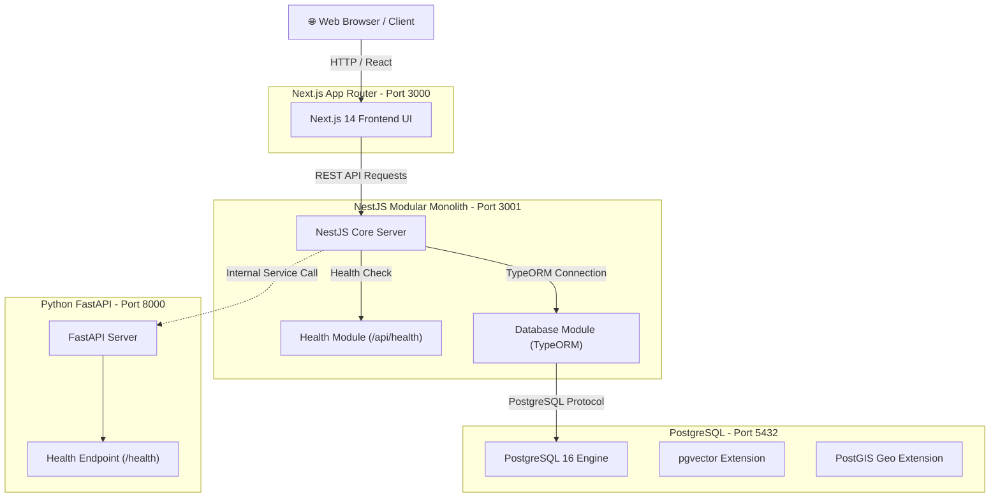

# SamadhanSetu — System Architecture & Design Specification (Phase 1)

## Executive Summary
**SamadhanSetu** is a societal innovation collaboration platform designed for SIH '26. It establishes a multi-stakeholder ecosystem connecting Citizens, Higher Education Institutions (HEIs), Industry Partners, and Government Impact Analytics to solve real-world problems.

Phase 1 focuses exclusively on establishing a **clean, modular, and scalable development foundation**.

---

## High-Level Architecture Diagram (Phase 1)



---

## Component Architectural Breakdown

### 1. Frontend Layer (`frontend/`)
- **Technology Stack**: Next.js 14 (App Router), TypeScript, Tailwind CSS, shadcn/ui.
- **Role**: Provides a modern, responsive user interface.
- **Phase 1 Implementation**: Clean baseline setup displaying initial platform identity and health status.

### 2. Backend Layer (`backend/`)
- **Technology Stack**: NestJS, TypeScript, TypeORM, REST API.
- **API Prefix**: Global `/api` versioning prefix.
- **Role**: Handles core business logic, user authentication, workflows, and database interactions.
- **Phase 1 Implementation**: Modular monolith foundation with global health check (`GET /api/health`) and TypeORM PostgreSQL database module.

### 3. AI Service Layer (`ai-service/`)
- **Technology Stack**: Python 3.11+, FastAPI, Uvicorn.
- **Role**: Logically separated microservice for AI intelligence processing.
- **Phase 1 Implementation**: Baseline service foundation with health check (`GET /health`).
- **Future Integration (Phase 3+)**:
  - Problem classification & categorisation
  - NLP summarisation & entity extraction
  - Embedding generation for deduplication (`pgvector`)
  - HEI & Industry capability matching algorithms

### 4. Database Infrastructure (`database/` & PostgreSQL container)
- **Technology Stack**: PostgreSQL 16 with `pgvector` and `uuid-ossp`.
- **Role**: Unified persistence layer for relational entities, spatial data, and AI embeddings.
- **Phase 1 Implementation**: Containerised Docker PostgreSQL service with extension initialization script (`init.sql`).

---

## Future Expansion Architecture

```text
                  ┌─────────────────────────────────────┐
                  │          Next.js Frontend           │
                  └──────────────────┬──────────────────┘
                                     │
                                     ▼
                  ┌─────────────────────────────────────┐
                  │           NestJS Backend            │
                  │  ┌──────────┬───────────┬─────────┐ │
                  │  │ Citizens │ Matching  │ Projects│ │
                  │  └──────────┴───────────┴─────────┘ │
                  └──────────┬──────────────┬───────────┘
                             │              │
              ┌──────────────┘              └──────────────┐
              ▼                                            ▼
   ┌────────────────────┐                       ┌────────────────────┐
   │    FastAPI AI      │                       │     PostgreSQL     │
   │  ┌──────────────┐  │                       │  ┌──────────────┐  │
   │  │ Embeddings   │  │                       │  │ Relational   │  │
   │  │ Classification│ │                       │  │ Geo (PostGIS)│  │
   │  └──────────────┘  │                       │  │ Vector Data  │  │
   └────────────────────┘                       └────────────────────┘
```

---

## Security & Environment Isolation
- Configuration is strictly driven by environment variables (`.env.example`).
- Secrets are excluded from version control via `.gitignore`.
- Internal services communicate over an isolated Docker network (`samadhan-network`).
